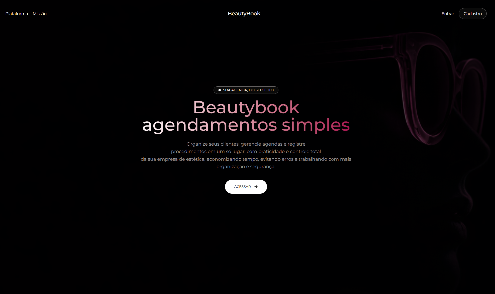
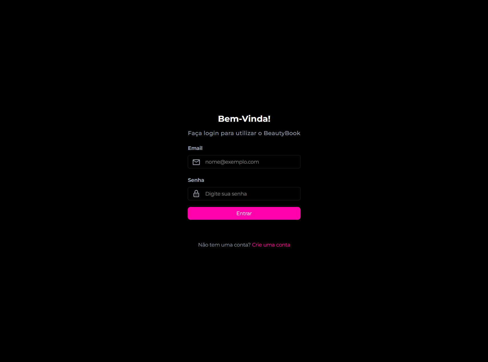
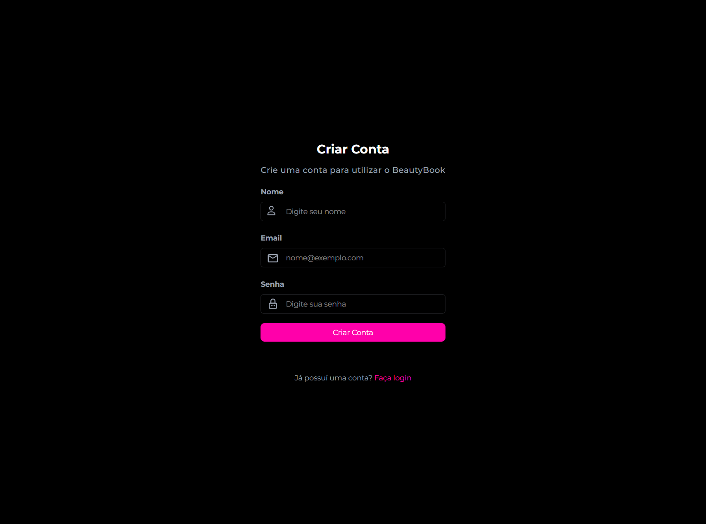
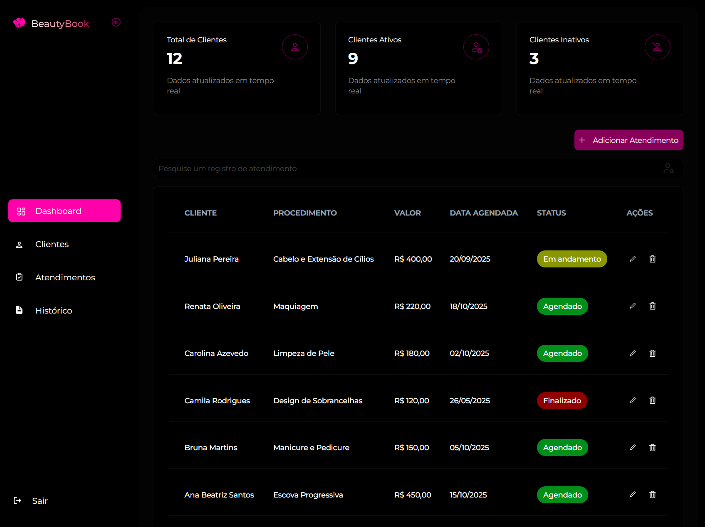
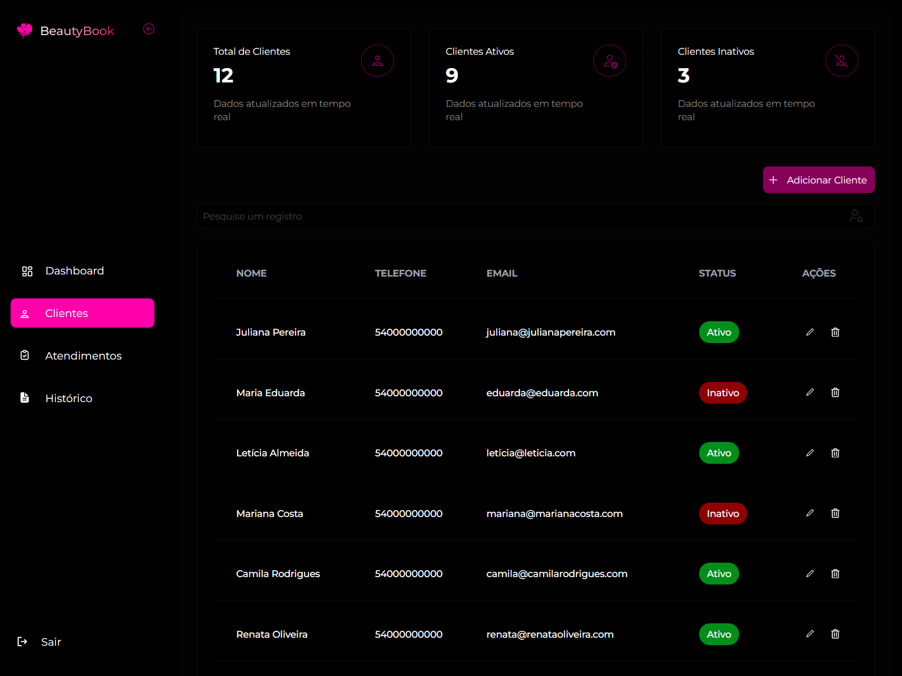
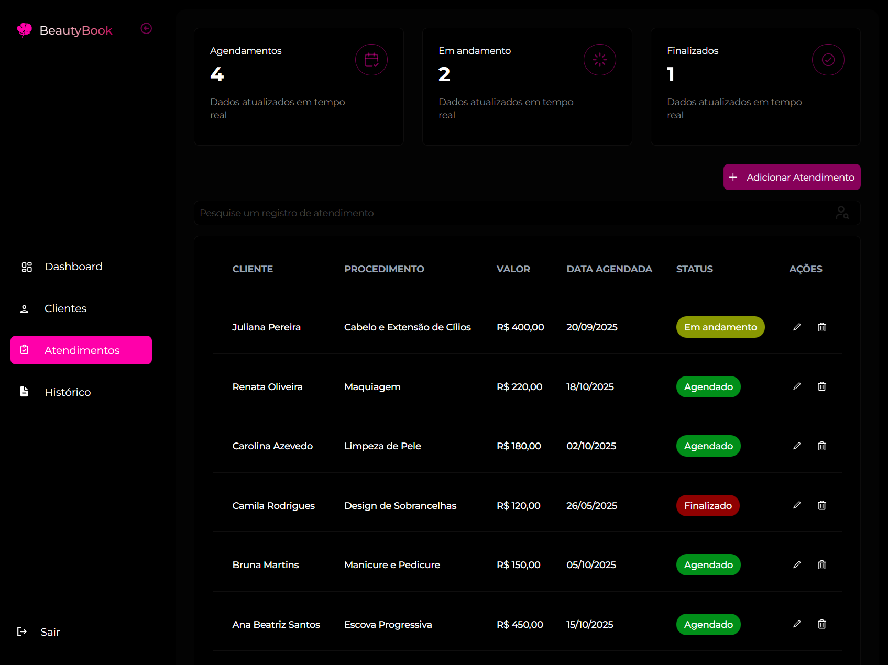
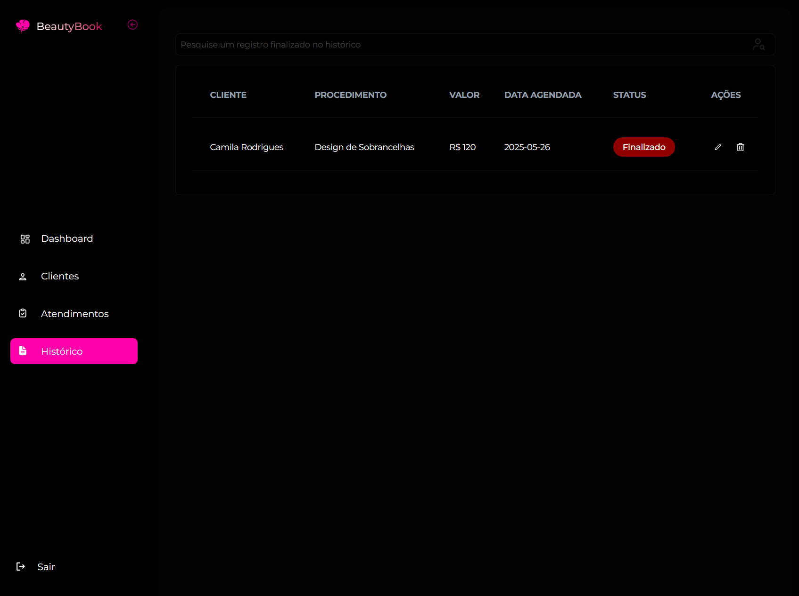

# BeautyBook – Agendamentos e Gestão para Profissionais de Estética e Beleza


Plataforma web para **agendamento e gestão de atendimentos de beleza**, desenvolvida especialmente para **mulheres autônomas**, **profissionais da área estética**, **salões de beleza** e **clínicas de estética** que desejam organizar clientes, procedimentos e agenda de forma simples, moderna e eficiente, **100% gratuita**.

---

## 🚀 Visão Geral

O **BeautyBook** nasceu para resolver uma dor comum entre profissionais da beleza: a falta de organização no controle de clientes e atendimentos feitos via WhatsApp, cadernos ou anotações espalhadas.

A plataforma centraliza tudo em um único lugar, permitindo:

- Cadastro organizado de clientes
- Agendamento de atendimentos
- Controle de status dos procedimentos
- Histórico completo de atendimentos finalizados
- Visão geral do negócio em um dashboard intuitivo

O sistema foi pensado principalmente para:

- Manicures / Nail designers
- Designers de cílios
- Maquiadoras
- Esteticistas
- Profissionais autônomas da beleza
- Microempresas e clínicas de estética

Sempre com foco em **organização, praticidade e profissionalismo**.

---

## 🖼️ Demonstração

### Login


### Cadastro (Signup)


### Dashboard


### Clientes


### Atendimentos


### Histórico


---

## 🧩 Funcionalidades

### 🔐 Autenticação

- Criação de conta (Signup)
- Login seguro
- Logout pelo menu lateral
- Rotas privadas protegidas

---

### 🏠 Dashboard (Visão Geral)

Após o login, a usuária tem acesso a um **dashboard inteligente**, reunindo informações importantes do negócio:

- Total de clientes cadastrados
- Clientes ativos e inativos
- Atendimentos agendados
- Atendimentos em andamento
- Atendimentos finalizados
- Tabela resumida de atendimentos

Tudo exibido em **cards informativos** e tabelas para rápida visualização.

---

### 👩‍💼 Gestão de Clientes

Seção dedicada exclusivamente ao controle de clientes:

- Cadastro de clientes
- Informações cadastradas:
  - Nome
  - Telefone
  - E-mail
  - Status (ativo / inativo)
- Listagem em tabela
- Inativação de clientes sem perder histórico
- Cards informativos com total de clientes ativos e inativos

> As informações dos clientes ficam organizadas em uma tabela dentro da própria seção de clientes.

---

### 📅 Agendamento de Atendimentos

Cadastro completo de atendimentos vinculados a clientes ativos:

- Seleção da cliente cadastrada
- Procedimento realizado
- Valor do atendimento
- Data agendada
- Observações adicionais

Ao cadastrar um novo atendimento, ele inicia com o status:

- 🟢 **Agendado**

---

### ⏱️ Controle de Status dos Atendimentos

Cada atendimento passa por três status bem definidos:

- 🟢 **Agendado** → atendimento marcado para uma data futura
- 🟡 **Em andamento** → procedimento iniciado
- 🔴 **Finalizado** → procedimento concluído

A mudança de status é feita diretamente na interface, facilitando o controle diário da agenda.

---

### 📜 Histórico de Atendimentos

Seção exclusiva para histórico:

- Exibe **apenas atendimentos finalizados**
- Atualização em tempo real
- Organização clara para consulta futura
- Base para análises de faturamento e produtividade

---

### 🧭 Navegação por Menu Lateral

A aplicação utiliza um **menu lateral intuitivo**, permitindo acesso rápido às seções:

- **Dashboard** → Visão geral
- **Clientes** → Cadastro e gerenciamento
- **Atendimentos** → Todos os atendimentos
- **Histórico** → Atendimentos finalizados

Em todas as tabelas, a usuária pode:
- Visualizar informações
- Atualizar status
- Excluir registros quando necessário

---

### 🌐 Landing Page

- Página institucional do Beautybook
- Apresentação clara da proposta da plataforma
- Destaque para simplicidade e custo zero
- Botões de acesso para **Login** e **Cadastro**

---

## 🛠️ Tecnologias Utilizadas

Projeto desenvolvido com tecnologias modernas e escaláveis:

- **Frontend:** React.js
- **Linguagem:** TypeScript
- **Estilização:** Tailwind CSS
- **Animações:** Motion (Framer Motion)
- **Backend / Serviços:** Firebase
  - Firebase Authentication
  - Firestore Database (Realtime updates)

---

## 📁 Estrutura do Projeto

```
├── src/
│ ├── assets/ # Arquivos estáticos
│ ├── components/ # Componentes reutilizáveis
│ ├── contexts/ # Context API (autenticação)
│ ├── layout/ # Layouts da aplicação
│ ├── pages/
│ │ ├── Admin
│ │ │   ├── Dashboard
│ │ │   ├── Clients
│ │ │   ├── Appointments
│ │ │   └── History
│ │ ├── Home (landing page)
│ │ ├── Login
│ │ ├── Signup
│ │ └── Notfound
│ ├── services/ # Integração com Firebase
│ ├── App.tsx
│ ├── main.tsx
│ └── index.css
├── .env
├── package.json
├── vite.config.ts
└── README.md

```
---

## ▶️ Como Executar o Projeto

### 📋 Pré-requisitos

- Node.js (versão 18 ou superior)
- NPM ou Yarn

---

### 🔧 Configuração do Ambiente

Este projeto utiliza **Firebase**.  
Crie um arquivo `.env` na raiz do projeto com as seguintes variáveis:

```env
VITE_FIREBASE_API_KEY=
VITE_FIREBASE_AUTH_DOMAIN=
VITE_FIREBASE_PROJECT_ID=
VITE_FIREBASE_STORAGE_BUCKET=
VITE_FIREBASE_MESSAGING_SENDER_ID=
VITE_FIREBASE_APP_ID=
```
> ⚠️ As credenciais podem ser obtidas no console do Firebase ao criar um novo projeto.

---

### ▶️ Executando a aplicação

```bash
# Clone o repositório
git clone https://github.com/rogeranacleto/beautybook-app.git

# Acesse a pasta do projeto
cd beautybook-app

# Instale as dependências
npm install

# Inicie a aplicação
npm run dev
```

---

## 🎯 Objetivo do Projeto

O **BeautyBook** foi desenvolvido para oferecer uma solução simples, acessível e profissional para mulheres que empreendem na área da beleza, como profissionais
autônomas, salões e clínicas de estética. A plataforma busca facilitar a organização de clientes, agendamentos e atendimentos, substituindo controles manuais e 
descentralizados por um sistema moderno, intuitivo e eficiente. Além disso, o projeto tem como objetivo consolidar conhecimentos em React, TypeScript, Tailwind CSS e 
Firebase, aplicados em um cenário real de produto.